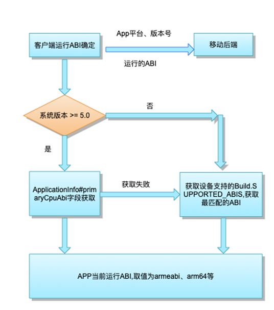

# 什么是abi
不同的Android设备可能使用不同的CPU，而每种CPU架构采用了其专有的指令集。CPU与指令集的每种组合都有专属的应用二进制接口,也就是Android Binary Interface(ABI)。Android支持的ABI类型：
| ABI类型 | 描述 | 
| ---- | ---- |
| mips/mips64 | Android系统比较少见 |
| x86/x64 | Intel x86架构提供Houdini指令集动态转码工具，实现对arm.so的兼容，并且市场占有率不到1%|
|armeabi|v5这是一个相当老旧的版本，缺少对浮点数计算的硬件支持，在需要大量计算的时候，有性能瓶颈|
|armeabi-v7a|v7 目前主流APP都提供的是这种ABI类型的so库|
|arm64-v8a|适用于基于 ARMv8-A 的 CPU，支持 64 位 AArch64 架构。它包含高级 SIMD (Neon) 架构扩展指令集。|
> 注意：通常支持 arm64-v8a 的 64 位设备，也可以向下兼容，支持 32 位的 abi 程序运行；也就是说APP可以只提供一套包含armeabi-v7a的so库，在所有包括64位的设备上面兼容运行。
# so库是如何与进程关联的
## Android 启动流程图

- 所有app由zygote进程fork出来，然后再创建单独的vm运行
- 支持64-bit系统的设备，会有两个Zygote(一个32-bit,一个64-bit)进程同时运行。
- 当app运行在64-bit 系统上时:
  - 如果app包含64-bit库，它将运行在一个64位进程中，即VM是由Zygote 64创建的(图中的2)。
  - 如果app包含32-bit 库,它将运行在一个32 bit进程中，即VM是由Zygote创建的(图中的3)
  - 如果app不包含本地库，它将默认运行在64 bit进程中。
## Android启动日志
如果想查看手机的Zygote启动过程，可以重启手机，查看log输出，过滤Zygote关键字，具体log信息如下：（以Pixel为例）
```
D/AndroidRuntime: >>>>>> START com.android.internal.os.ZygoteInit uid 0 <<<<<<
D/AndroidRuntime: >>>>>> START com.android.internal.os.ZygoteInit uid 0 <<<<<<
D/Zygote: begin preload
I/Zygote: Calling ZygoteHooks.beginPreload()
I/Zygote: Preloading classes...
W/Zygote: Class not found for preloading: android.app.-$$Lambda$ActivityThread$ZXDWm3IBeFmLnFVblhB-IOZCr9o
I/Zygote: Accepting command socket connections
I/Zygote: ...preloaded 7590 classes in 1080ms.
I/Zygote: Preloading resources...
I/Zygote: ...preloaded 64 resources in 49ms.
I/Zygote: ...preloaded 41 resources in 6ms.
I/Zygote: Preloading shared libraries...
I/Zygote: Called ZygoteHooks.endPreload()
I/Zygote: Installed AndroidKeyStoreProvider in 1ms.
I/Zygote: Warmed up JCA providers in 11ms.
D/Zygote: end preload
D/Zygote: Forked child process 912
I/Zygote: System server process 912 has been created
I/Zygote: Accepting command socket connections
I/SystemServer: SecondaryZygotePreload
I/Zygote: Lazily preloading resources.
D/Zygote: begin preload
I/Zygote: Calling ZygoteHooks.beginPreload()
I/Zygote: Preloading classes...
I/Zygote: ...preloaded 7590 classes in 892ms.
I/Zygote: Preloading resources...
I/Zygote: ...preloaded 64 resources in 55ms.
I/Zygote: ...preloaded 41 resources in 7ms.
D/Zygote: Forked child process 1558
D/Zygote: Forked child process 1577
D/Zygote: Forked child process 1628
D/Zygote: Forked child process 1639
D/Zygote: Forked child process 1697
I/Zygote: Process 1628 exited cleanly (0)
D/Zygote: Forked child process 1739
W/ZygoteProcess: Got error connecting to zygote, retrying. msg= Connection refused
I/Zygote: Process 1639 exited cleanly (0)
```
从log中可以看出，先启动Zygote进程，然后再启动SecondaryZygote进程。Zygote进程启动后，会fork出许多子进程，来作为系统应用进程和用户应用进程。
## zygote启动选择
Android 系统会根据设备的**ro.zygote**属性值决定启动哪个Zygote。属性值与对应的Zygote进程关系如下：
- zygote32：只启动一个32位的Zygote进程。
- zygote32_64：启动两个Zygote进程，分别为32位和64位，32位的进程名为zygote，64位进程名为zygote_secondary ，以32位为主。
- zygote64：启动一个64位的Zygote进程
- zygote64_32：启动两个Zygote进程，分别为32位和64位，64位的进程名为zygote，32位进程名为zygote_secondary ，以64位为主。

可以进入adb shell，执行getprop | grep ro.zygote来查看手机的zygote情况：（以HUAWEI Mate 10为例）


## app进程启动
应用app具体会运行到哪个进程，我们从一个app的启动入手分析。app的启动一般从该应用的桌面图标点击开始，调用startActivity(Intent), 再通过Binder IPC机制, 最终调用到AMS。AMS会执行如下操作:
1. 通过PackageManager的resolveIntent()收集这个intent对象的指向信息.
2. 通过grantUriPermissionLocked()方法来验证用户是否有足够的权限去调用该intent对象指向的Activity.
3. 如果有权限, AMS会检查并在新的task中启动目标activity.
4. 如果ProcessRecord是null, AMS调用startProcessLocked()方法来创建新的进程.
```
private final void startProcessLocked(ProcessRecord app, String hostingType,
            String hostingNameStr, String abiOverride, String entryPoint, String[] entryPointArgs) {
    ......
     String requiredAbi = (abiOverride != null) ? abiOverride : app.info.primaryCpuAbi;
     if (requiredAbi == null) {
        requiredAbi = Build.SUPPORTED_ABIS[0];
     }
    ......
    startResult = Process.start(entryPoint,
        app.processName, uid, uid, gids, debugFlags, mountExternal,
        app.info.targetSdkVersion, seInfo, requiredAbi, instructionSet,
        app.info.dataDir, invokeWith, entryPointArgs);
    ......
}
```
AMS先获取要启动的APP的primaryCpuAbi属性值，如果primaryCpuAbi为空，则以设备支持的首个ABI属性值为主，设备支持的ABI列表可以通过执行getprot ro.product.cpu.abilist查看，最后调用Process的start()方法，将读取ABI值传入。

Process类的start方法调用路径如下：
```
Process:start(...)                      -->
ZygoteProcess:start(...)                -->
ZygoteProcess:startViaZygote(...)       -->
ZygoteProcess:openZygoteSocketIfNeeded(...)
```
其重要的实现在openZygoteSocketIfNeeded方法里面，下面我们来看一下详细的实现：
```
  private ZygoteState openZygoteSocketIfNeeded(String abi) throws ZygoteStartFailedEx {
        Preconditions.checkState(Thread.holdsLock(mLock), "ZygoteProcess lock not held");

        if (primaryZygoteState == null || primaryZygoteState.isClosed()) {
            try {
                primaryZygoteState = ZygoteState.connect(mSocket);
            } catch (IOException ioe) {
                throw new ZygoteStartFailedEx("Error connecting to primary zygote", ioe);
            }
        }

        if (primaryZygoteState.matches(abi)) {
            return primaryZygoteState;
        }

        // The primary zygote didn't match. Try the secondary.
        if (secondaryZygoteState == null || secondaryZygoteState.isClosed()) {
            try {
                secondaryZygoteState = ZygoteState.connect(mSecondarySocket);
            } catch (IOException ioe) {
                throw new ZygoteStartFailedEx("Error connecting to secondary zygote", ioe);
            }
        }

        if (secondaryZygoteState.matches(abi)) {
            return secondaryZygoteState;
        }

        throw new ZygoteStartFailedEx("Unsupported zygote ABI: " + abi);
    }
```
从上图可以看出，其根据传进来的参数abi里面，去匹配ZygoteState里面的abilist列表，默认先查找主Zygote进程支持的abilist;如果查找不到，再去查找辅助的Zygote进程支持的abilist。当查找到匹配的ZygoteState对象的时候，就会从该Zygote进程fork一个新的子进程，作为该app的运行进程。
## primaryCpuAbi
上面提到过app.info.primaryCpuAbi的值，会对APP最终运行在32位还是64位进程起到决定性的作用。那么app.info.primaryCpuAbi的值又是在哪里确定的呢？其实这个值就是在PMS里面的scanPackageDirtyLI这个方法里面实现的。
PMS类的scanPackageDirtyLI方法调用逻辑如下：
```
    PackageManagerService:scanPackageDirtyLI(...)   -->
    PackageManagerService:derivePackageAbi(...) -->
    NativeLibraryHelper:copyNativeBinariesForSupportedAbi(...)  -->
    NativeLibraryHelper:findSupportedAbi(...)   -->
    NativeLibraryHelper:nativeFindSupportedAbi(...)
```
按照上面的调用顺序，我们先来看一下derivePackageAbi的实现：
```
    private static void derivePackageAbi(PackageParser.Package pkg, File scanFile,
            String cpuAbiOverride, boolean extractLibs, File appLib32InstallDir)
            throws PackageManagerException {
        // Give ourselves some initial paths; we'll come back for another
        // pass once we've determined ABI below.
        //......
        NativeLibraryHelper.Handle handle = null;
        try {
            handle = NativeLibraryHelper.Handle.create(pkg);
            //......
            String[] abiList = (cpuAbiOverride != null) ?
                    new String[] { cpuAbiOverride } : Build.SUPPORTED_ABIS;
            //......
            final int copyRet;
            if (extractLibs) {
                copyRet = NativeLibraryHelper.copyNativeBinariesForSupportedAbi(handle,
                        nativeLibraryRoot, abiList, useIsaSpecificSubdirs);
            } else {
                copyRet = NativeLibraryHelper.findSupportedAbi(handle, abiList);
            }
            //......
            if (copyRet >= 0) {
                //......
                pkg.applicationInfo.primaryCpuAbi = abiList[copyRet];
            } else if (copyRet == PackageManager.NO_NATIVE_LIBRARIES && cpuAbiOverride != null) {
                pkg.applicationInfo.primaryCpuAbi = cpuAbiOverride;
            } else if (needsRenderScriptOverride) {
                pkg.applicationInfo.primaryCpuAbi = abiList[0];
            }
        }
    }
```
真正的copyRet值，是在com_android_internal_content_NativeLibraryHelper.cpp类的findSupportedAbi实现的：
```
static int findSupportedAbi(JNIEnv *env, jlong apkHandle, jobjectArray supportedAbisArray,
                                jboolean debuggable) {
        const int numAbis = env->GetArrayLength(supportedAbisArray);
        Vector<ScopedUtfChars*> supportedAbis;
        for (int i = 0; i < numAbis; ++i) {
            supportedAbis.add(new ScopedUtfChars(env,
                    (jstring) env->GetObjectArrayElement(supportedAbisArray, i)));
        }
        ZipFileRO* zipFile = reinterpret_cast<ZipFileRO*>(apkHandle);
        if (zipFile == NULL) {
            return INSTALL_FAILED_INVALID_APK;
        }
        std::unique_ptr<NativeLibrariesIterator> it(
                NativeLibrariesIterator::create(zipFile, debuggable));
        if (it.get() == NULL) {
            return INSTALL_FAILED_INVALID_APK;
        }
        ZipEntryRO entry = NULL;
        int status = NO_NATIVE_LIBRARIES;
        while ((entry = it->next()) != NULL) {
            // We're currently in the lib/ directory of the APK, so it does have some native
            // code. We should return INSTALL_FAILED_NO_MATCHING_ABIS if none of the
            // libraries match.
            if (status == NO_NATIVE_LIBRARIES) {
                status = INSTALL_FAILED_NO_MATCHING_ABIS;
            }
            const char* fileName = it->currentEntry();
            const char* lastSlash = it->lastSlash();
                // Check to see if this CPU ABI matches what we are looking for.
            const char* abiOffset = fileName + APK_LIB_LEN;
            const size_t abiSize = lastSlash - abiOffset;
            for (int i = 0; i < numAbis; i++) {
                const ScopedUtfChars* abi = supportedAbis[i];
                if (abi->size() == abiSize && !strncmp(abiOffset, abi->c_str(), abiSize)) {
                    // The entry that comes in first (i.e. with a lower index) has the higher priority.
                    if (((i < status) && (status >= 0)) || (status < 0) ) {
                        status = i;
                    }
                }
            }
        }
        //......
        return status;
    }
```
上面代码可以看出，其从apk的安装包里面获取lib目录下面的文件夹，跟系统支持的abilist进行比较，如果相同，则默认返回该abi对应的abilist里面的索引值。如果apk里面的lib下面有多个ABI类型的文件夹，这里以abilist里面第一个匹配的结果为准。到这里，用户应用的app.info.primaryCpuAbi已经赋值完毕。

通过以上代码分析，我们可以得出结论，如果应用要适配64位，只需要在APK的lib目录下面提供arm64_v8a对应的所有的so库就可以了。
# 64位适配
## 64位适配的价值
- 64位处理器搭配64位系统运行64位软件，执行效率将成倍提升。
- 受限于Google Play应用商店政策要求，未适配64位架构则不能上架Google Play应用商店。
- 国内及国外厂商已加速跟进google的应用商店政策，目前三星，华为，VIVO,OPPO等厂商应用商店已经支持32位和64位，不过尚未强制要求。但是针对适配64位的应用，会进行主力推广宣传。
## 64位适配的分类
针对64位适配存在两种情况，一种是apk里面不包含so库，一种是apk里面包含so库。针对不包含so库的apk，从上面的分析可以看出，会直接从主Zygote进程fork出来一个进程，来作为该apk的运行进程。如果是包含so库的apk，是由apk里面lib目录下面so库的ABI类型决定的。
## app引用so库的方式
常见的Android应用引用so库的方式有以下三种：
- apk自带的so库。Android系统在安装apk的时候，会根据当前手机CPU支持的ABI列表以及apk里面的so库支持的ABI类型，拷贝最匹配的so库，并保存在app的存储路径的lib下面。
- 插件自带的so库。根据当前程序运行的进程情况，加载合适的so库；
- 云端下发的so库。下载完成后通过路径进行加载。客户端需要根据当前应用运行的进程情况，去获取相应类型的so库，进行加载。
下面对这三种方式进行适配说明
### apk自带so库的适配
  这里我们仍有两条适配路经要作出选择，一种是比较粗暴的，即构建一个支持所有的ABI类型的apk，优点是可以满足任意机型的安装，缺点是包体积可能变得非常大。另一种是比较轻量级的，即为每个ABI类型都单独构建一个apk，不同ABI类型的设备安装对应的apk，前提条件是应用市场需要根据用户的手机设备CPU，下发对应的合适的apk包，目前Google Play市场是完全支持的，国内市场比如华为,VIVO,OPPO也是支持多个ABI的apk，并且提供按需下发。

apk里面的so库来源有两种，一种是**工程lib**里面的，一种是**依赖的AAR**里面的，在打包的时候通过build.gradle里面配置如下参数来控制生成的apk里面是包含什么ABI类型的so库。

```javascript
    ndk {
        abiFilter “v8a-64”, "armeabi", "armeabi-v7a", "arm64_v8a"
    }
```

### 插件内的so库的适配
不管是通过何种方式实现的插件化，插件APK里面都可能会包含so库。插件里面的so库加载有三种方案：
- 方案一，提供包含所有ABI类型的so库的插件包；
- 方案二，提供多个包含不同ABI架构的插件包；
- 方案三，提供一个基础的不包含so库的插件包，再把每种CPU架构的so库生成一个apk。

### 云端下发的so库适配
  针对云端下发的so库，我们专门设计了一个so分发管理平台来实现64位架构的适配。该架构参考应用市场的前后端设计，增强兼容性（云端so库和app里面的so库存在依赖关系）问题的处理。</br>
  so分发管理平台分为两部分：前端SDK部分，后端发布平台部分，下面我们来看一下设计架构图
  

#### 客户端部分

在请求后端接口时，Request会携带app平台字段、app版本号和运行时的进程信息，获取接口配置数据，客户端根据网络状态下载对应so库的zip包并解压到相应文件夹。
>注意：客户端需要根据当前apk内置的libs目录和当前手机支持的SUPPORT ABIs共同决定运行时ABI

#### 后端发布平台部分
后端接口根据客户端上传的APP平台标识，app版本号和app运行时ABI，下发正确的so版本和下载地址给客户端。
使用方在后端平台需要上传多种ABI类型的so库文件。
#### 前端SDK代码实现
- so库管理支持版本管理，数据结构与插件版本管理类似，每个版本的so库都是一个SoSource实例，根据来源不同，分为在线OnLineSoSource，本地AssetSoSource，SdcardSoSource等，常用的是OnLineSoSource。每个so库由于app升级或者后端接口数据更新，会有多个不同版本的SoSource实例，统一使用LibraryOwner管理，获取已下载完成的最高版本so库使用。

- 初始化
加载本地缓存数据和拉取线上接口数据，两者数据合并之后，正确处理so实例对象状态，对于未安装的实例进行下载操作，下载策略同插件下载类似，目前只在wifi下自动下载。


- so库实例状态机
每个so库实例都有一定的状态机演化，类似插件，只有达到已安装状态（InstalledState）后，才能够被加载。


- so库兼容性
和插件最低版本号类似，也定义了最低兼容版本号。当主app发生升级时，线上的so库如果不兼容了，就必须强制卸载升级，防止加载了有问题的so库而导致崩溃；如果是向前兼容的，则可以继续使用上个版本的so库，而没有必要重新下载。


前端SDK代码的核心代码逻辑如下：
```javascript
    //so库文件从移动后端获取成功之后
    private void mergeDataIntoMemory(List<LibraryOwner> data, int type) {
        for (LibraryOwner owner : data) {
            String pkg = owner.getPkg();
            LibraryOwner inside = mNativeLibs.get(pkg);
            if (inside == null) {
                // 内存缓存没有，添加进缓存
                mNativeLibs.put(pkg, owner);
            } else {
                // 内存缓存已经存在， 合并数据
                mergeNativeLibData(inside, owner);
            }
        }
        if (type == SoSource.SOURCE_FORM_ONLINE) {
            // 线上数据返回之后，处理下线操作
            handleOffline(data);
        }
        // 处理版本的兼容性
        handleVersionCompact();
        // 处理cpu架构变化
        handleAbiChanged();
        // 注册监听器
        registerInside();
        if (type == SoSource.SOURCE_FORM_ONLINE) {
            // 缓存数据
            mCacheManager.updateLibInfos(mNativeLibs.values());
            // 开始下载安装
            startProcessing();
            // 清理不兼容或者废弃的so库目录
            cleanOutOfDateLibrary();
        }
    }
```

版本兼容(最低版本号)处理逻辑：
- 如果云端so库和apk内的so库存在依赖关系，那么升级过程就可能会出现兼容性问题。在每次版本升级的过程中，如果已有版本不能兼容，就需要直接废弃以前的so库，重新下载最新的so库。通过设置最低版本号的支持，每次判断so库zip包的最低版本号。如果高于现有版本，就强制下线已有版本，重新下载最新版本。


cpu架构变化的处理：
- 由于国内市场还是支持32位的，爱奇艺Android客户端会长期存在32位和64位并行的情况。所以应用升级的时候，根据app运行的是32位进程还是64位进程，升级到对应的apk。升级之后，打开应用，加载云端so库的时候，就需要先判断CPU架构是否发生变化，如果发生变化，就直接抛弃所有的旧的so库，重新下载新的so库。
## 重点关注事项-应用升级
- 版本内升级：需要在应用自己的官网提供两个apk，32位和64位的；升级的时候，根据app运行的是32位进程还是64位进程，升级到对应的apk。如果你手机安装的apk是32+64位的包，按照上面的升级逻辑，也是没有问题的。也就是说忽略你安装的apk，只考虑你的app运行时的进程就可以了。
- 渠道升级：渠道升级的话，会按照你的手机支持的CPU情况，下载对应的应用包。这里就会存在32位升级到64位或者64位升级到32位的情况，客户端加载so库之前，要先根据abi判断，是否存在对应的so库，如果不存在，删除已有的，重新下载，加载。有人可能会有疑惑，为什么会存在32位升级到64位呢，指定渠道应该都是64位的包吧。比如用户很早以前安装的爱奇艺是32位，有新版本之后，去oem应用商店升级到了64位。
## 重点关注事项-Tinker热修复问题
针对一个渠道对应多个包（32位，64位，32+64位），如果一次打包只能产生一种类型的包，一个渠道多次打包肯定会导致同一渠道的多个包的dex是不一致的，这样热修的时候可能需要下发多个patch。为了简化流程，针对一个渠道key，下发一个patch。所以需要打包平台做一些处理，代码编译一次，先产生一个32+64位的包，然后对这个包进行处理，生成对应的32位包和64位包，之后重新签名apk文件即可。


