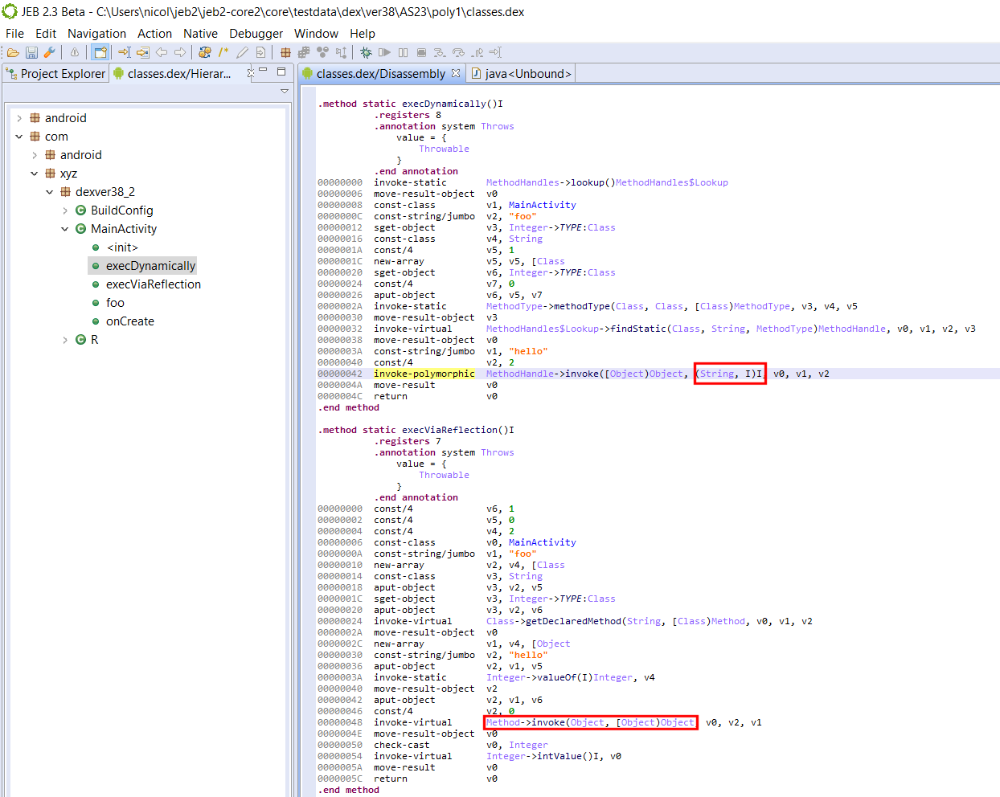

# MethodHandle
类似于反射，可以支持某个对象方法的调用。不同于反射，methodHandle顾名思义是基于方法的操作，它的特点是把访问控制放在了创建时。使用方式如下：
```
MethodHandles.Lookup lookup = MethodHandles.findLookUp();
MethodHandle mh = lookup.findVirtual(classType, methodName, methodType);
```
> 不是很理解java设计这个的作用，可以理解为面向函数编程？因为将方法的调用者以参数形式传入，所以方法不再依赖于对象而存在。
# invokeDynamic
## 动态语言支持
动态语言和静态语言的定义其实比较模糊，一些关键区分点是是否有编译期间类型检查，是否可以运行时修改类结构等。java本身是以静态语言为目标设计的，所以jvm字节码最开始也只是支持4个基本的指令调用
- invokeVirtual 调用具体对象方法
- invokeSpecial 调用特殊处理方法，构造方法、私有方法和父类方法
- invokeStatic 静态方法调用
- invokeInterface 运行时搜索实现接口的对象，找到对应方法调用
这几类指令，在调用时都会传入方法调用的类、方法名以及方法类型，这些信息都作为符号引用储存在字节码中的常量表里，在类加载时会转为对应的直接引用（可被jvm识别的指针）。也就是说，在生成字节码的那一刻起，这个调用会调用哪个方法就被确定了。</br>
jvm不仅是为java提供运行环境，它还想支持多种其他语言。因此为了支持动态语言，让方法调用在运行时确定，jvm引入了invokeDynamic指令。</br>
可能这里比较难理解，所谓的运行时确定方法调用是指什么，其实有动态语言开发经历的同学能理解，比如js，我在js中调用`a.run()`，这时我不需要提前指明a对应哪个类，只需要a对应的类中有`run`方法，就可以完成调用。</br>
这在java中不可能，java需要定义一个接口，接口中有run方法，`a`实现了接口后，才能有调用run方法的能力。</br>
因此，jvm引入了invokeDynamic，只需要在指令调用时传入方法名和方法类型，将具体方法的方法实现交给BSM来在运行时动态生成，从而实现了jvm对动态语言的支持。
## 样例字节码参考
```
public class LambdaTest {
    public static void main(String[] args) {
        Runnable r = () -> System.out.println(Arrays.toString(args));
        r.run();
    }
}
```
上述代码在 javap -v -p LambdaTest 转成字节码后
```
Classfile ./com/company/LambdaTest.class
  Last modified 2017-10-11; size 1296 bytes
  MD5 checksum 7ac0bf40633d31a57673577fde0a699d
  Compiled from "LambdaTest.java"
public class com.company.LambdaTest
  minor version: 0
  major version: 52
  flags: ACC_PUBLIC, ACC_SUPER
Constant pool:
   #1 = Methodref          #8.#25         // java/lang/Object."<init>":()V
   #2 = InvokeDynamic      #0:#30         // #0:run:([Ljava/lang/String;)Ljava/lang/Runnable;
   #3 = InterfaceMethodref #31.#32        // java/lang/Runnable.run:()V
   #4 = Fieldref           #33.#34        // java/lang/System.out:Ljava/io/PrintStream;
   #5 = Methodref          #35.#36        // java/util/Arrays.toString:([Ljava/lang/Object;)Ljava/lang/String;
   #6 = Methodref          #37.#38        // java/io/PrintStream.println:(Ljava/lang/String;)V
   #7 = Class              #39            // com/company/LambdaTest
   #8 = Class              #40            // java/lang/Object
   #9 = Utf8               <init>
  #10 = Utf8               ()V
  #11 = Utf8               Code
  #12 = Utf8               LineNumberTable
  #13 = Utf8               LocalVariableTable
  #14 = Utf8               this
  #15 = Utf8               Lcom/company/LambdaTest;
  #16 = Utf8               main
  #17 = Utf8               ([Ljava/lang/String;)V
  #18 = Utf8               args
  #19 = Utf8               [Ljava/lang/String;
  #20 = Utf8               r
  #21 = Utf8               Ljava/lang/Runnable;
  #22 = Utf8               lambda$main$0
  #23 = Utf8               SourceFile
  #24 = Utf8               LambdaTest.java
  #25 = NameAndType        #9:#10         // "<init>":()V
  #26 = Utf8               BootstrapMethods
  #27 = MethodHandle       #6:#41         // invokestatic java/lang/invoke/LambdaMetafactory.metafactory:(Ljava/lang/invoke/MethodHandles$Lookup;Ljava/lang/String;Ljava/lang/invoke/MethodType;Ljava/lang/invoke/MethodType;Ljava/lang/invoke/MethodHandle;Ljava/lang/invoke/MethodType;)Ljava/lang/invoke/CallSite;
  #28 = MethodType         #10            //  ()V
  #29 = MethodHandle       #6:#42         // invokestatic com/company/LambdaTest.lambda$main$0:([Ljava/lang/String;)V
  #30 = NameAndType        #43:#44        // run:([Ljava/lang/String;)Ljava/lang/Runnable;
  #31 = Class              #45            // java/lang/Runnable
  #32 = NameAndType        #43:#10        // run:()V
  #33 = Class              #46            // java/lang/System
  #34 = NameAndType        #47:#48        // out:Ljava/io/PrintStream;
  #35 = Class              #49            // java/util/Arrays
  #36 = NameAndType        #50:#51        // toString:([Ljava/lang/Object;)Ljava/lang/String;
  #37 = Class              #52            // java/io/PrintStream
  #38 = NameAndType        #53:#54        // println:(Ljava/lang/String;)V
  #39 = Utf8               com/company/LambdaTest
  #40 = Utf8               java/lang/Object
  #41 = Methodref          #55.#56        // java/lang/invoke/LambdaMetafactory.metafactory:(Ljava/lang/invoke/MethodHandles$Lookup;Ljava/lang/String;Ljava/lang/invoke/MethodType;Ljava/lang/invoke/MethodType;Ljava/lang/invoke/MethodHandle;Ljava/lang/invoke/MethodType;)Ljava/lang/invoke/CallSite;
  #42 = Methodref          #7.#57         // com/company/LambdaTest.lambda$main$0:([Ljava/lang/String;)V
  #43 = Utf8               run
  #44 = Utf8               ([Ljava/lang/String;)Ljava/lang/Runnable;
  #45 = Utf8               java/lang/Runnable
  #46 = Utf8               java/lang/System
  #47 = Utf8               out
  #48 = Utf8               Ljava/io/PrintStream;
  #49 = Utf8               java/util/Arrays
  #50 = Utf8               toString
  #51 = Utf8               ([Ljava/lang/Object;)Ljava/lang/String;
  #52 = Utf8               java/io/PrintStream
  #53 = Utf8               println
  #54 = Utf8               (Ljava/lang/String;)V
  #55 = Class              #58            // java/lang/invoke/LambdaMetafactory
  #56 = NameAndType        #59:#63        // metafactory:(Ljava/lang/invoke/MethodHandles$Lookup;Ljava/lang/String;Ljava/lang/invoke/MethodType;Ljava/lang/invoke/MethodType;Ljava/lang/invoke/MethodHandle;Ljava/lang/invoke/MethodType;)Ljava/lang/invoke/CallSite;
  #57 = NameAndType        #22:#17        // lambda$main$0:([Ljava/lang/String;)V
  #58 = Utf8               java/lang/invoke/LambdaMetafactory
  #59 = Utf8               metafactory
  #60 = Class              #65            // java/lang/invoke/MethodHandles$Lookup
  #61 = Utf8               Lookup
  #62 = Utf8               InnerClasses
  #63 = Utf8               (Ljava/lang/invoke/MethodHandles$Lookup;Ljava/lang/String;Ljava/lang/invoke/MethodType;Ljava/lang/invoke/MethodType;Ljava/lang/invoke/MethodHandle;Ljava/lang/invoke/MethodType;)Ljava/lang/invoke/CallSite;
  #64 = Class              #66            // java/lang/invoke/MethodHandles
  #65 = Utf8               java/lang/invoke/MethodHandles$Lookup
  #66 = Utf8               java/lang/invoke/MethodHandles
{
  public com.company.LambdaTest();
    descriptor: ()V
    flags: ACC_PUBLIC
    Code:
      stack=1, locals=1, args_size=1
         0: aload_0
         1: invokespecial #1                  // Method java/lang/Object."<init>":()V
         4: return
      LineNumberTable:
        line 6: 0
      LocalVariableTable:
        Start  Length  Slot  Name   Signature
            0       5     0  this   Lcom/company/LambdaTest;

  public static void main(java.lang.String[]);
    descriptor: ([Ljava/lang/String;)V
    flags: ACC_PUBLIC, ACC_STATIC
    Code:
      stack=1, locals=2, args_size=1
         0: aload_0
         1: invokedynamic #2,  0              // InvokeDynamic #0:run:([Ljava/lang/String;)Ljava/lang/Runnable;
         6: astore_1
         7: aload_1
         8: invokeinterface #3,  1            // InterfaceMethod java/lang/Runnable.run:()V
        13: return
      LineNumberTable:
        line 8: 0
        line 9: 7
        line 10: 13
      LocalVariableTable:
        Start  Length  Slot  Name   Signature
            0      14     0  args   [Ljava/lang/String;
            7       7     1     r   Ljava/lang/Runnable;

  private static void lambda$main$0(java.lang.String[]);
    descriptor: ([Ljava/lang/String;)V
    flags: ACC_PRIVATE, ACC_STATIC, ACC_SYNTHETIC
    Code:
      stack=2, locals=1, args_size=1
         0: getstatic     #4                  // Field java/lang/System.out:Ljava/io/PrintStream;
         3: aload_0
         4: invokestatic  #5                  // Method java/util/Arrays.toString:([Ljava/lang/Object;)Ljava/lang/String;
         7: invokevirtual #6                  // Method java/io/PrintStream.println:(Ljava/lang/String;)V
        10: return
      LineNumberTable:
        line 8: 0
      LocalVariableTable:
        Start  Length  Slot  Name   Signature
            0      11     0  args   [Ljava/lang/String;
}
SourceFile: "LambdaTest.java"
InnerClasses:
     public static final #61= #60 of #64; //Lookup=class java/lang/invoke/MethodHandles$Lookup of class java/lang/invoke/MethodHandles
BootstrapMethods:
  0: #27 invokestatic java/lang/invoke/LambdaMetafactory.metafactory:(Ljava/lang/invoke/MethodHandles$Lookup;Ljava/lang/String;Ljava/lang/invoke/MethodType;Ljava/lang/invoke/MethodType;Ljava/lang/invoke/MethodHandle;Ljava/lang/invoke/MethodType;)Ljava/lang/invoke/CallSite;
    Method arguments:
      #28 ()V
      #29 invokestatic com/company/LambdaTest.lambda$main$0:([Ljava/lang/String;)V
      #28 ()V
```
这里java的invokeDynamic指令参数会指向#0，在字节码中展示为BootstrapMethods，它包含的是一个methodHandle。这个methodHandle指向的是java/lang/invoke/LambdaMetafactory.metafactory的静态方法调用。</br>
```
public static CallSite metafactory(MethodHandles.Lookup caller,
                                       String invokedName,
                                       MethodType invokedType,
                                       MethodType samMethodType,
                                       MethodHandle implMethod,
                                       MethodType instantiatedMethodType)
            throws LambdaConversionException {
        AbstractValidatingLambdaMetafactory mf;
        mf = new InnerClassLambdaMetafactory(caller, invokedType,
                                             invokedName, samMethodType,
                                             implMethod, instantiatedMethodType,
                                             false, EMPTY_CLASS_ARRAY, EMPTY_MT_ARRAY);
        mf.validateMetafactoryArgs();
        return mf.buildCallSite();
    }
```
这个方法会生成一个绑定lambda表达式内方法的methodHandle的CallSite，具体这个method是如何创建的，需要看一下我们metafactory传入的参数的作用
```
private static final String NAME_FACTORY = "get$Lambda";
@Override
    CallSite buildCallSite() throws LambdaConversionException {
        final Class<?> innerClass = spinInnerClass();
        if (invokedType.parameterCount() == 0) {
            final Constructor<?>[] ctrs = AccessController.doPrivileged(
                    new PrivilegedAction<>() {
                @Override
                public Constructor<?>[] run() {
                    Constructor<?>[] ctrs = innerClass.getDeclaredConstructors();
                    if (ctrs.length == 1) {
                        // The lambda implementing inner class constructor is private, set
                        // it accessible (by us) before creating the constant sole instance
                        ctrs[0].setAccessible(true);
                    }
                    return ctrs;
                }
                    });
            if (ctrs.length != 1) {
                throw new LambdaConversionException("Expected one lambda constructor for "
                        + innerClass.getCanonicalName() + ", got " + ctrs.length);
            }

            try {
                Object inst = ctrs[0].newInstance();
                return new ConstantCallSite(MethodHandles.constant(samBase, inst));
            }
            catch (ReflectiveOperationException e) {
                throw new LambdaConversionException("Exception instantiating lambda object", e);
            }
        } else {
            try {
                UNSAFE.ensureClassInitialized(innerClass);
                return new ConstantCallSite(
                        MethodHandles.Lookup.IMPL_LOOKUP
                             .findStatic(innerClass, NAME_FACTORY, invokedType));
            }
            catch (ReflectiveOperationException e) {
                throw new LambdaConversionException("Exception finding constructor", e);
            }
        }
    }
```
可以看到，根据动态调用的方法是否需要传入参数，callsite分别指向了构造方法和一个名为get$Lambda的MethodHandle。而invokeDynamic指令，会生成这个callsite并调用其中的methodHandle，生成一个接口的实现类对象。最终invokeinterface会调用这个实现类对象的方法，从而调用lambda的方法。我把这部分字节码截取出来分析下：
```
        0: aload_0
         1: invokedynamic #2,  0              // InvokeDynamic #0:run:([Ljava/lang/String;)Ljava/lang/Runnable;
         6: astore_1
         7: aload_1
         8: invokeinterface #3,  1            // InterfaceMethod java/lang/Runnable.run:()V
        13: return
```
首先aload_0会加载run方法调用时需要的string参数，invokedynamic会生成runnable然后astore_1存入后aload_1取出，最终调用invokeinterface，触发run方法的调用。

lambda表达式会生成一个实现了接口的匿名类，匿名类包含一个固定方法get$Lambda（针对包含参数的，不包含参数可以直接调用构造方法），并且会生成接口的方法实现，实现中会调用lambda表达式所在类中生成的静态方法。参考下面代码：
```
import java.lang.invoke.LambdaForm.Hidden;

// $FF: synthetic class 生成的匿名类
final class LambdaTest$$Lambda$1 implements Runnable {
    private final String[] arg$1;

    private LambdaTest$$Lambda$1(String[] var1) {
        this.arg$1 = var1;
    }

    private static Runnable get$Lambda(String[] var0) {
        return new LambdaTest$$Lambda$1(var0);
    }

    @Hidden
    public void run() {
        LambdaTest.lambda$main$0(this.arg$1);
    }
}
```
```
// lambda表达式所在类生成的静态方法
private static void lambda$main$0(java.lang.String[] args){
    System.out.println(Arrays.toString(args));
}
```
前三个参数，lookup是用来定位创建lambda表达式所在类的，string是接口方法的名称，methodType是返回接口实现的方法类型。有lookup能得到类叫 LambdaTest， 从而得到生成的匿名类名称`LambdaTest$$Lambda$1`（这是固定规则），然后动态创建类文件。这时创建的类需要创建一个string名称的方法(run)和一个methodType类型的`get$Lambda`方法，同时还会将methodType类型中的入参作为该类的field。</br>
后面三个参数，主要是run方法内容，因为它代表的是被调用的方法类型，方法句柄还有一个不清楚作用据说和泛型有关的方法类型。</br>

最终，通过运行时利用ASM创建匿名类的方式，实现了方法的动态调用，后续实现方式的变化取决于BSM中方法的实现，也许`metafactory`就会换成其他的方法。
> PS: 因为该类是运行时动态创建的，所以也不会额外占用java内存模型中常量池/永久区的大小。如果针对每一个动态调用在编译时生成一个类，那在动态语言中，就会占用相当大的常量池空间

参考： [深入理解Invokedynamic](https://www.jianshu.com/p/a4626689c325)</br>
[理解 invokedynamic](https://juejin.cn/post/6844903503236710414)</br>
[Android Java8 Lambda 脱糖（ASM Hook 埋点)](https://juejin.cn/post/6855129007248769038)
[A First Taste of InvokeDynamic](http://blog.headius.com/2008/09/first-taste-of-invokedynamic.html)
[invokedynamic指令](https://www.cnblogs.com/wade-luffy/p/6058087.html)
[invokedynamic字节码指令](https://www.cnblogs.com/kelthuzadx/p/10754574.html)
## android dalvik指令——方法调用
- invoke-virtual:普通方法调用（非private、static或final，也不是构造函数）
- invoke-super: 调用invoke-virtual的父类虚方法，限制同invoke-virtual，支持接口方法调用
> 这里调用的是该接口的未被覆盖的方法，从版本037后开始支持。个人感觉有了这个支持后，java接口才能支持默认方法。
- invoke-direct:调用非static的直接方法，包括private和构造函数
> 感觉direct挺形象的，相比virtual，在调用时不需要方法引用，就可以直接知道是哪个方法，因为方法不会被覆盖。
- invoke-static: 调用static方法
- invoke-interface: 调用接口方法，对具体类未知的对象使用method_id
- invoke-polymorphic: 038版本新增， 三个参数分别为调用方式（invoke/invokeExact，区别在于是否允许拆装箱）、调用函数原型（参数与返回值）以及指向该方法的methodHandle（methodHandle的调用相关代码会由该字节码生成）
```
  static Object execDynamically() throws Throwable {
        return MethodHandles.lookup().findStatic(MainActivity.class,"foo",
                MethodType.methodType(int.class, String.class, int.class)).invoke("hello", 2);
    }

    static Object execViaReflection() throws Throwable {
        return MainActivity.class.getDeclaredMethod("foo", String.class, int.class).invoke(null, "hello", 2);
    }

```

- invoke-custom: 类似于java invokeDynamic, 先取CallSite pool中是否有对应的CallSite, 没有则根据item信息创建CallSite。然后给callSite绑定对应的MethodHandle，然后进行调用。\
参考：[Android O and DEX 38: Dalvik Opcodes for Dynamic Invocation](https://www.pnfsoftware.com/blog/android-o-and-dex-version-38-new-dalvik-opcodes-to-support-dynamic-invocation/)

# tips补充
Kotlin1.5之前，SAM类型（单一抽象方法接口）代码会被转成匿名类或单例，1.5之后则会转成invokeDynamic。如果有针对java使用lambda时invokeDynamic使用的问题，就会导致kotlin中使用lambda也出现问题。

下面是1.5以前：
```
class TestSam {

    fun test_Singleton() {
        TestSam().target_JavaInterface(SimpleInterface { "|| called" })
    }

    fun test_newObject() {
        TestSam().target_JavaInterface(SimpleInterface { "${this::class.java.simpleName} || called" })
    }

    fun target_JavaInterface(simpleInterface: SimpleInterface) {
        println("inside target_JavaInterface: ${simpleInterface.getResult("123")}")
    }
    
}
编译成字节码然后反编译：
public final class TestSam {
   public final void test_Singleton() {
      (new TestSam()).target((SimpleInterface)null.INSTANCE);
   }

   public final void test_newObject() {
      (new TestSam()).target((SimpleInterface)(new SimpleInterface() {
         @NotNull
         public final String getResult(String it) {
            return TestSam.this.getClass().getSimpleName() + " || called";
         }
      }));
   }

   public final void target(@NotNull SimpleInterface simpleInterface) {
      Intrinsics.checkParameterIsNotNull(simpleInterface, "simpleInterface");
      String var2 = "inside test1: " + simpleInterface.getResult("123");
      boolean var3 = false;
      System.out.println(var2);
   }
}
```
1.5以后，改用invokeDynamic实现，参考：[SAM adapters via invokedynami](https://kotlinlang.org/docs/whatsnew15.html#sam-adapters-via-invokedynamic)