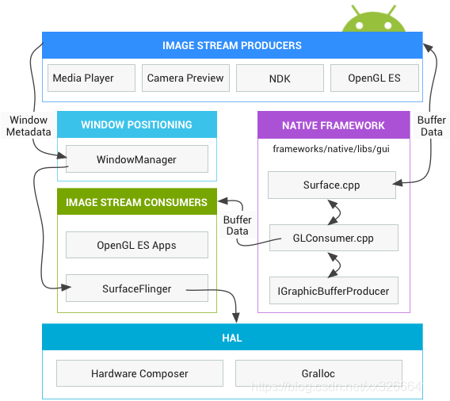
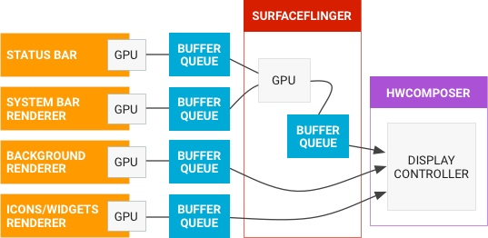
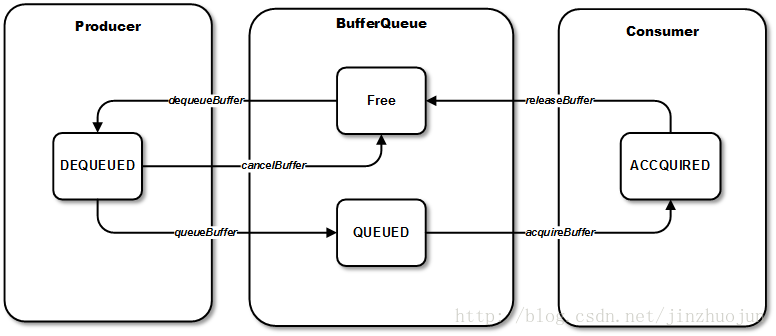
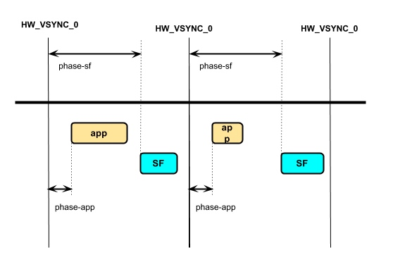
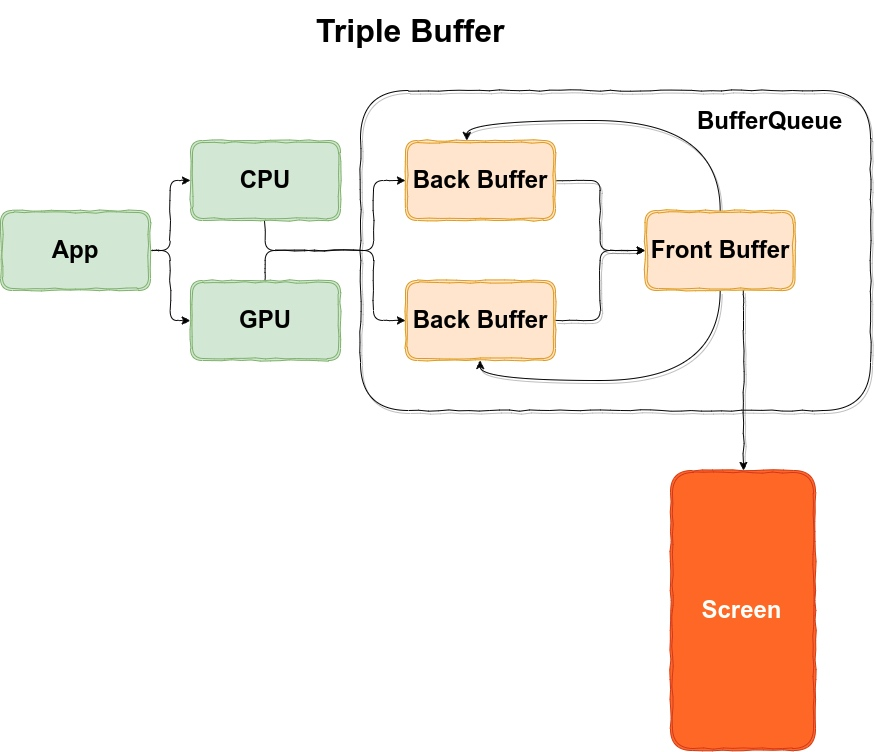

# 概述
上一节我们提到了view经历了MainThread和RenderThread的绘制与渲染后，需要将绘制内容传给设备进行展示，本节我们将阐述“设备”将app侧的渲染结果处理后展示到屏幕上的流程，并对过程中一些经常被混淆的概念（例如vsync-app与vsync-sf信号、双缓冲vs三缓冲，Fence机制）等进行介绍。
# 渲染流程
view的绘制到展示，需要经过MainThread计算布局与绘制信息，得到CPU参与计算的结果后，通过RenderThread来对surface进行中GraphicBuffer进行绘制，绘制结果会传给SurfaceFlinger的BufferQueue，SurfaceFlinger会从BufferQueue中取出数据，并调用HWComposer来合并多个Layer的绘制结果，最终绘制到屏幕进行展示。
官方流程图如下：

这个是常见的图形渲染的架构图

这个是抽象的渲染数据流通图
我理解的整体流程如图：


这里涉及了一些定义，包括SurfaceFlinger,BufferQueue,GraphicBuffer,HWComposer等，后面会一一介绍
## BufferQueue
这个类很重要，关于Android的双缓冲三缓冲都是基于它实现的，它的本质是一个生产者消费者模型。

app侧产生的数据会塞到队列中，由surfaceFlinger取出送到HWComposer合成，BufferQueue数据结构如图所示。

数据存储在GraphicBuffer中，数据单元是BufferSlot，以列表形式存在，而BufferQueue的队列长度由两个值共同决定，一个是mMaxAcquiredBufferCount，代表消费者最多持有的buffer数，一个是mMaxDequeuedBufferCount，代表生产者最多持有的buffer数
## GraphicBuffer
这个类是真正用来存放数据的，它包含着一个指向具体内存位置的指针，以及对数据宽高的描述信息。渲染数据从app侧传输到屏幕展示的过程中，访问的内存一直是这一片，因为app侧与SurfaceFlinger是不同进程，所以这片数据通过共享内存方式进行传递
> 注意：这里真正数据的共享是通过共享内存方式实现的，并不是Android特有的binder通信，binder通信只负责传递surfaceFlinger有新的buffer绘制完成这里的通知信息。
## SurfaceFlinger
对这个类，一直的状态都是有听闻，但是又不是特别了解，这次总算明白它做了什么。
### 作用概述
SurfaceFlinger的本质是一个controller，它其实是app侧到硬件侧之间的管理者。它负责接收vsync-sf信号，然后取出不同Layer传来的buffer数据，并通过HWComposer来将多层数据合并，最终将需要展示的数据交付给FrameBufferSurface消费。
### 进程通信
由于SurfaceFlinger由SystemServer进程创建，为系统进程，所以需要和app之间通过binder进行进程通信。因此在该进程中，同样是通过Looper形式来进行消息分发的，app侧的Layer::onFrameAvailable方法，会通知给SF，调用signalLayerUpdate，进而创建一个事件插入事件队列，等待vsync-sf信号到来时，触发该事件。
```
// Layer.cpp
void Layer::onFrameAvailable(const BufferItem& item) {
    // Add this buffer from our internal queue tracker
    { // Autolock scope
        Mutex::Autolock lock(mQueueItemLock);

        mQueueItems.push_back(item);
        android_atomic_inc(&mQueuedFrames);

        // Wake up any pending callbacks
        mLastFrameNumberReceived = item.mFrameNumber;
        mQueueItemCondition.broadcast();
    }

    mFlinger->signalLayerUpdate();
}
// SurfaceFlinger.cpp
void SurfaceFlinger::signalLayerUpdate() {
    mEventQueue.invalidate();
}
void MessageQueue::invalidate() {
    mEvents->requestNextVsync();
}
// vsync信号到来触发
void SurfaceFlinger::onMessageReceived(int32_t what) {
    ATRACE_CALL();
    switch (what) {
        case MessageQueue::INVALIDATE: {
            bool refreshNeeded = handleMessageTransaction();
            refreshNeeded |= handleMessageInvalidate();
            refreshNeeded |= mRepaintEverything;
            if (refreshNeeded) {
                // Signal a refresh if a transaction modified the window state,
                // a new buffer was latched, or if HWC has requested a full
                // repaint
                signalRefresh();
            }
            break;
        }
        case MessageQueue::REFRESH: {
            handleMessageRefresh();
            break;
        }
    }
}
```
参考：https://www.jianshu.com/p/afd525c4f437
## HWComposer
这个简单说下，我理解就是用来合并多buffer数据的驱动。
## FrameBufferSurface
很多博客会提到FrameBuffer，我理解指的就是这个类，用于将SF合成的数据传递给真正的显示层。
# vsync信号
它的作用就是触发刷新，它和设备屏幕刷新率挂钩。60HZ屏幕每16.6ms就发送一次该信号，而120HZ或90HZ将发送时间缩短，从而增加了一秒内渲染的次数。

事实上，vsync信号产生后，会分别作用于渲染数据的生产端和消费端，所以也就有了以下两种信号的区分：
- vysnc-app 
  
  搭配 Choreographer , 给上层 App 的渲染提供一个稳定的 Message 处理的时机.每隔16.6 ms，Vsync 信号唤醒 Choreographer 来做 App 的绘制操作。
- vsync-sf 
    
    配合 SurfaceFlinger 使用，用于触发SF的合成操作，收到该信号后，会执行前面事件队列中提到的合成事件。
## vysnc offset
关于这个offset，了解一下就好。Vsync Offset 指的是 VSYNC_APP 和 VSYNC_SF 之间有一个 Offset，即App 和 SurfaceFlinger 进程不是同时收到 Vsync 信号，而是间隔 Offset (通常在 0 - 16.6ms 之间)。如果 offset=0 ，app和sf同时收到vsync信号，sf合成的只能是n-1帧。而sf晚于app收到信号，就有可能在app渲染结束时，sf直接对当前帧进行合成。

# 双缓冲/三缓冲
这个问题其实困扰我比较久，网上有大量相关的讲解，但是都是在描述双缓冲和三缓冲的概念，就二者是怎么实现的以及作用于图像渲染的哪个阶段，就很少有描述了。
- 问题1: 双缓冲和三缓冲如何实现？
  
  其实前面已经提到过，双/三缓冲机制依赖于 BufferQueue 来实现，app渲染后的数据在 BufferQueue 的 dequedBuffer 中，而SF用于合成的数据取自 acquiredBuffer 中。双缓冲对应着一个 dequeBuffer 和一个 acquiredBuffer ，三缓冲对应着两个 dequedBuffer 和一个 acquiredBuffer。
- 问题2: 缓冲作用于渲染的哪个阶段
  了解了问题1，其实问题2也就明白了。双缓冲和三缓冲是对整个渲染流程的描述，准确说其中一个缓冲在SF合成侧，剩下1/2个缓冲在app渲染侧
  
# Fence机制
它是用来做同步的。由于 CPU 和 GPU 之间的通信是异步的，所以 CPU 处理完交给 GPU 处理的 buffer，处理完成后 CPU 就继续处理下一个 buffer了，不会阻塞等待 GPU。那这时 buffer 已经 queue 到 BufferQueue 队列中了，SF 在收到 vsync 信号后就会取出 buffer 进行合成，如果这时 GPU 没有生产完毕，就会出现异常。因此诞生了 Fence 机制，用于保证 SF 在 GPU 没有渲染完毕时，不去合成数据。

GraphicBuffer 在传递时会带一个 Fence 标记，用于记录该内存是否已经被使用完毕。它有两种形式，acquireFence 和 releaseFence。前者用于生产者通知消费者生产已完成，后者用于消费者通知生产者消费已完成。

参考：

[BufferQueue笔记](https://www.jianshu.com/p/ccd5da85cf9e)

[Android中的GraphicBuffer同步机制-Fence](https://blog.csdn.net/jinzhuojun/article/details/39698317)

[Android VSYNC与图形系统中的撕裂、双缓冲、三缓冲浅析](https://blog.csdn.net/happylishang/article/details/104196560)

[Android 图形架构之一 ——概述
](https://xuexuan.blog.csdn.net/article/details/108870372)

[Android Graphics Framework](https://www.jianshu.com/p/afd525c4f437)

[Systrace 系列介绍](https://www.androidperformance.com/2019/05/28/Android-Systrace-About/)