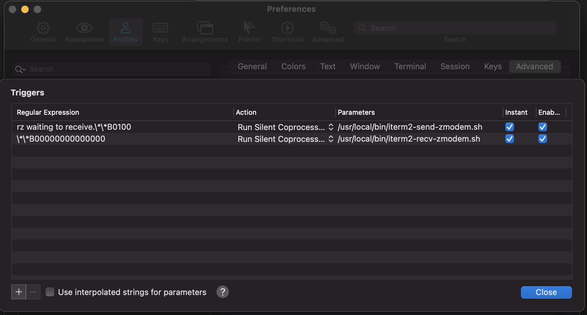

# python3环境安装
python3 安装比较简单，只需要下载对应的tgz压缩包，然后传到服务器解压即可（注意：解压后为了方便调用，需要为对应路径配置软链接）
## mac 上传下载文件
mac可以使用item2代替xshell完成文件的上传下载，安装item2后，按照下述方式增加triggers，即可通过rz/sz命令触发文件上传下载
> Preferences -> profile -> advanced -> triggers



## python3编译安装
python3解压后，进入解压目录，然后执行以下指令
```
./configure
make
make install
```
分别对应着配置检查，编译，安装

安装成功后，配置软链接
```
ln -s /usr/local/python38 /usr/local/bin/python3
ls -l /usr/local/bin/
```
此外，pip也需要配置软链接从而方便访问
## python3 卸载
删除分两步，一步删除python本身，一步删除pip和python的软链接
```
rpm -qa|grep python3|xargs rpm -ev --allmatches --nodeps
whereis python3 |xargs rm -frv
rm -rf ./pip3(python3)
```
## ssl库找不到问题
使用python运行python脚本时，出现类似以下错误
```
requests.exceptions.SSLError: HTTPSConnectionPool(host='api.ipify.org', 
port=443): Max retries exceeded with url: / (Caused by SSLError("Can't 
connect to HTTPS URL because the SSL module is not available.")
```

这表示requests库访问ssl模块时没有访问到，而ssl模块正常应该是随着python的安装就安装到本地的，访问不到有以下原因：

- ssl地址问题
- 模块未安装

实际安装发现，python3.6和3.7都没有自带ssl的安装，需要手动安装openssl
```
yum install openssl-devel
```
安装完成后，本地就有了openssl，这时再继续解决地址问题

观察了make的日志，发现提示以下内容

```
Python build finished successfully!
The necessary bits to build these optional modules were not found:
_ssl  
```
这个日志是在make时调用setup.py文件查找module时打出的，因此找到setup.py文件，查看对应目录，把openssl所在目录添加上就可以了。

```
# Detect SSL support for the socket module (via _ssl)
 844         search_for_ssl_incs_in = [
 845                               '/usr/local/ssl/include',
 846                               '/usr/contrib/ssl/include/'
 847                              ]
 // 这里是include目录，将openssl的include目录加进去
 848         ssl_incs = find_file('openssl/ssl.h', inc_dirs,
 849                              search_for_ssl_incs_in
 850                              )
 851         if ssl_incs is not None:
 852             krb5_h = find_file('krb5.h', inc_dirs,
 853                                ['/usr/kerberos/include'])
 854             if krb5_h:
 855                 ssl_incs += krb5_h
 856         ssl_libs = find_library_file(self.compiler, 'ssl',lib_dirs,
 857                                      ['/usr/local/ssl/lib',
 858                                       '/usr/contrib/ssl/lib/'
 859                                      ] )
 860 // 这里是lib录，将openssl的include目录加进去
 861         if (ssl_incs is not None and
 862             ssl_libs is not None):
 863             exts.append( Extension('_ssl', ['_ssl.c'],
 864                                    include_dirs = ssl_incs,
 865                                    library_dirs = ssl_libs,
 866                                    libraries = ['ssl', 'crypto'],
 867                                    depends = ['socketmodule.h']), )
 868         else:
 869             missing.append('_ssl')

```
加入对应目录后，模块即可找到，然后就能执行对应脚本了

# crontab添加定时任务

这个使用比较简单，调用`crontab -e`就可以编辑定时任务，然后按照对应的语法规则增加任务即可。

## crontab任务不执行

先调用`tail -f /var/log/cron`查看日志，然后如果服务挂掉了没有执行脚本，就重启服务`service crond restart`，如果服务正常，检查脚本路径是否有问题，必须是全路径